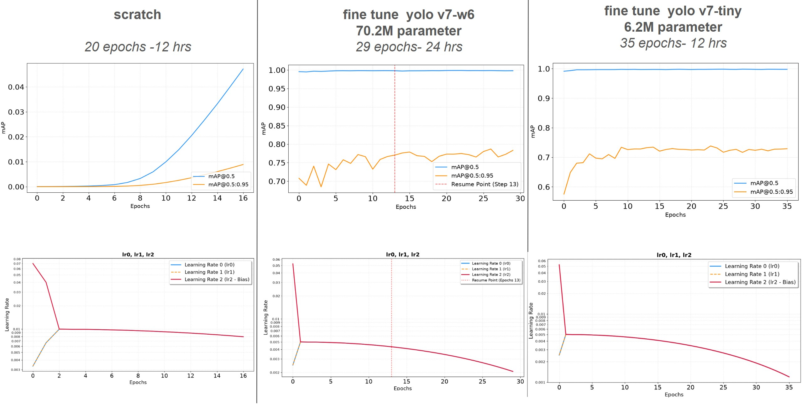
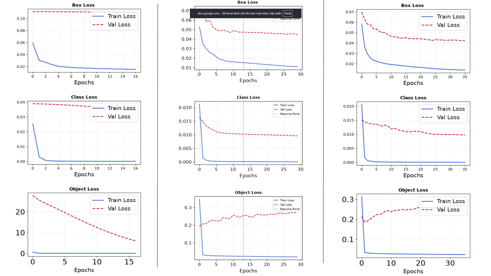

## Introduction

This repository provides the training and benchmarking pipeline for evaluating
[MotionTrack](https://github.com/lzq11/MotionTrack) — a multi-object tracker
built on a YOLOv7 detector — on a custom [wildlive dataset](https://dat-nguyenvn.github.io/WildLive/), in addition to the
standard COCO-pretrained setup.

Specifically, this repo covers:

- **Dataset reformatting** — converting the
  [wildlive dataset](https://dat-nguyenvn.github.io/WildLive/)
  into the annotation and directory format required by the MotionTrack
  tracker and YOLOv7 detector (MOT-style `gt.txt`, `seqinfo.ini`, frame
  sequences).
- **Detector fine-tuning** — fine-tuning the YOLOv7 detector weights on the
  reformatted wildlive dataset for improved detection accuracy on
  wildlive-specific classes (elephant, zebra, giraffe).
- **Benchmarking** — running and evaluating MotionTrack with both the
  original COCO-pretrained weights and the fine-tuned wildlive weights, for
  direct performance comparison.


> **Note:** The video shows the tracking result of MotionTrack running with the fine-tuned wildlife weights.

## Install

Since the source code is implemented as notebooks, you can run this
project on either **Google Colab** or **Kaggle**. Before running any
notebook, make sure the wildlive dataset is placed according to the
structure required in the [Data Preparation](#data-preparation) section.

### Detect

Download the YOLOv7 pretrained weights from the
[YOLOv7 releases page](https://github.com/WongKinYiu/yolov7/releases).
Make sure to download the weights with the `_training` suffix (e.g.
`yolov7-w6_training.pt`, `yolov7-tiny_training.pt`), since these are
optimized for fine-tuning rather than inference.

#### Training

Run:
```
detect_train_kaggle.ipynb
```

#### Optional
This section is for resuming training if you want to continue from where you left off in a previous training run.

The weight file from the previous step must not be used on its own —
it needs to be placed inside the following directory structure:
```
 run/
 ├── weights/
 │       └── last.pt
 ├── hyp.yaml
 └── opt.yaml
```
Once the structure above is in place, run:
```
detect_resume_kaggle.ipynb
```

### Track

- To run tracking using the wildlive fine-tuned weights, run:
```
track_wl_weight_up.ipynb
```
- To run tracking using the COCO-pretrained weights, run:
```
track_coco_weight_up.ipynb
```

> **Note:** Weight paths and output/result paths in the notebooks are set
> up based on the original author's environment. Before running, update
> these paths to match your own setup (e.g. dataset location, weight file
> location, and output directory).

## Data Preparation
### Original [wildlive dataset](https://dat-nguyenvn.github.io/WildLive/) structure
```
        wildlive_dataset/
        |---sequence_name1/
                |---frames/
                |       |---frame_0.jpg
                |       |---frame_1.jpg ...
                |---boxid/
                        |---frame_0.jpg
                        |---frame_1.jpg ...
```

### Structure required by the MotionTrack detector (YOLOv7)
        JMT2022
        |——————images
        |        └——————train
        |                   └——————img_file(*.jpg)
        |        └——————test1
        |——————labels
        |        └——————train
        |                   └——————label_file(*.txt)
        |        └——————test1

### Structure required by the MotionTrack tracker
        jmt2022/
        └── dataset/
                ├── test/
                ├── seq_001/
                │   ├── seqinfo.ini
                │   ├── seq_001/
                │   │   ├── 000001.jpg
                │   │   ├── 000002.jpg
                │   │   └── ...
                │   └── det/
                │       └── det.txt
                ├── seq_002/
                └── ...

### Why this repo exists

Since the original wildlive dataset layout differs from what the MotionTrack
detector and tracker each expect, this repo integrates conversion scripts
that automatically transform the original wildlive structure into the
format required by MotionTrack — **no manual restructuring needed** on
your end.

To use these scripts, place the wildlive dataset in the following layout:
```
        MotionTrack-wildlive/
        └── wildlive_dataset/
                ├── datawildlive_train/
                ├── datawildlive_val/
                └── datawildlive_test/
```

### Evaluation Set

Due to hardware constraints (GPU and storage), only a subset of the wildlife dataset is used for evaluation — approximately 7,600 frames (35% of the total available frames).

|  | Frames |
| ----- | ------ |
| Train | 7,607  |
| Val   | 1,200  |
| Test  | 161    |

## Weights

We fine-tune two pretrained YOLOv7 checkpoints — **YOLOv7-tiny** and **YOLOv7-W6** — released by the [YOLOv7 assets](https://github.com/WongKinYiu/yolov7/releases) on a subset of our custom wildlive dataset. We benchmark both the COCO-pretrained baselines and their wildlive fine-tuned counterparts to evaluate the impact of domain-specific fine-tuning on tracking performance.

| Model | Download |
|---|---|
| YOLOv7 (COCO pretrained) | [weights](https://github.com/epsilon-thieu/MotionTrack-wildlive/releases/download/weights/yolov7.pt) |
| YOLOv7-tiny (COCO pretrained) | [weights](https://github.com/epsilon-thieu/MotionTrack-wildlive/releases/download/weights/yolov7-tiny.pt) |
| YOLOv7-W6 (COCO pretrained) | [weights](https://github.com/epsilon-thieu/MotionTrack-wildlive/releases/download/weights/yolov7-w6.pt) |
| YOLOv7-tiny (fine-tuned, wildlive) | [weights](https://github.com/epsilon-thieu/MotionTrack-wildlive/releases/download/weights/last_yolov7_tiny.pt) |
| YOLOv7-W6 (fine-tuned, wildlive) | [weights](https://github.com/epsilon-thieu/MotionTrack-wildlive/releases/download/weights/last_yolov7_w6.pt) |

> **Note:** COCO-pretrained checkpoints are used as baselines for comparison against the wildlive fine-tuned models.

## Result

### Training Results


The plots below show the detection fine-tuning progress on the wildlive
dataset — mAP over epochs and the corresponding training loss curves.




### Tracking


**FPS**

| Model    | YOLOv7 | YOLOv7-Tiny | YOLOv7-W6 | YOLOv7-Tiny (fine-tuned) | YOLOv7-W6 (fine-tuned) |
| -------- | ------ | ----------- | --------- | ------------------------- | ------------------------ |
| FPS      | 12     | 36          | 13.5      | 43                         | 10.3                     |

**Validation Video**

| Model                     | IDF1  | Recall | Precision | MOTA  | IDs |
| -------------------------- | ----- | ------ | --------- | ----- | --- |
| YOLOv7                     | 93.9%  | 99.3%   | 99.2%      | 98.4%  | 6   |
| YOLOv7-W6                  | 93.4%  | 99.3%   | 88.5%      | 86.3%  | 11  |
| YOLOv7-Tiny                 | 82.2%  | 95.1%   | 95.8%      | 90.6%  | 62  |
| YOLOv7-W6 (fine-tuned)      | 99.6% | 99.6%  | 99.7%     | 99.2% | 0   |
| YOLOv7-Tiny (fine-tuned)    | 98.6% | 98.6%  | 98.6%     | 99.8% | 1   |

**Test Video**

| Model                     | IDF1  | Recall | Precision | MOTA  | IDs |
| -------------------------- | ----- | ------ | --------- | ----- | --- |
| YOLOv7                     | 95.9%  | 97%     | 95%        | 91.8%  | 2   |
| YOLOv7-W6                  | 96.2%  | 97.3%   | 95.3%      | 92.4%  | 2   |
| YOLOv7-Tiny                 | 94.4%  | 92.9%   | 96.1%      | 89.0%  | 2   |
| YOLOv7-W6 (fine-tuned)      | 98.2% | 99.1%  | 97.3%     | 96.3% | 2   |
| YOLOv7-Tiny (fine-tuned)    | 97.9% | 99%    | 96.8%     | 95.7% | 2   |