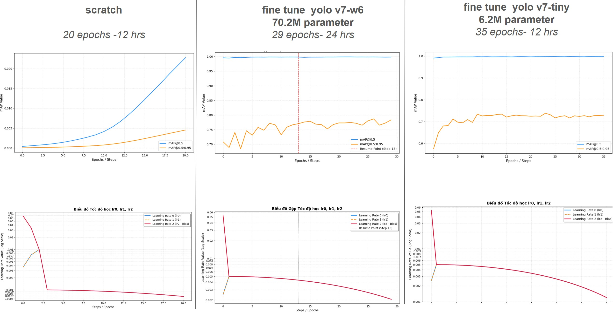
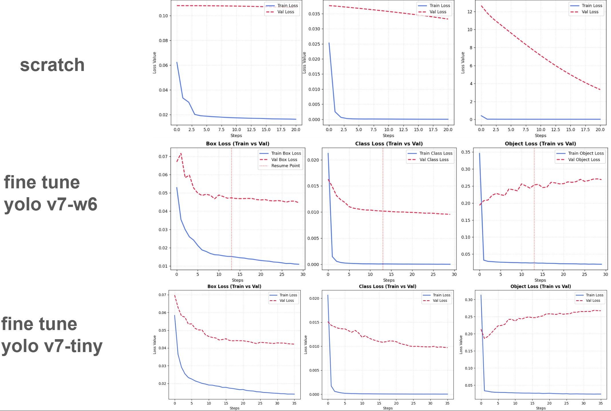

## Introduction

This repository provides the training and benchmarking pipeline for evaluating
[MotionTrack](https://github.com/lzq11/MotionTrack) — a multi-object tracker
built on a YOLOv7 detector — on a custom wildlife dataset, in addition to the
standard COCO-pretrained setup.

Specifically, this repo covers:

- **Dataset reformatting** — converting the
  [Wildlife dataset](https://data.bris.ac.uk/data/dataset/ewnuoroebuae20vei0cu6zu69)
  into the annotation and directory format required by the MotionTrack
  tracker and YOLOv7 detector (MOT-style `gt.txt`, `seqinfo.ini`, frame
  sequences).
- **Detector fine-tuning** — fine-tuning the YOLOv7 detector weights on the
  reformatted wildlife dataset for improved detection accuracy on
  wildlife-specific classes (elephant, zebra, giraffe).
- **Benchmarking** — running and evaluating MotionTrack with both the
  original COCO-pretrained weights and the fine-tuned wildlife weights, for
  direct performance comparison.


## Data Preparation
### Original [wildlife dataset](https://data.bris.ac.uk/data/dataset/ewnuoroebuae20vei0cu6zu69) structure
```
        wildlife_dataset/
        |---sequence_name1/
                |---frames/
                |       |---frame_0.jpg
                |       |---frame_1.jpg ...
                |---boxid/
                        |---frame_0.jpg
                        |---frame_1.jpg ...
```

### Structure required by the MotionTrack detector (YOLOv7)
        JMT2022
        |——————images
        |        └——————train
        |                   └——————img_file(*.jpg)
        |        └——————test1
        |——————labels
        |        └——————train
        |                   └——————label_file(*.txt)
        |        └——————test1

### Structure required by the MotionTrack tracker
        jmt2022/
        └── dataset/
                ├── test/
                ├── seq_001/
                │   ├── seqinfo.ini
                │   ├── seq_001/
                │   │   ├── 000001.jpg
                │   │   ├── 000002.jpg
                │   │   └── ...
                │   └── det/
                │       └── det.txt
                ├── seq_002/
                └── ...

### Why this repo exists

Since the original wildlife dataset layout differs from what the MotionTrack
detector and tracker each expect, this repo integrates conversion scripts
that automatically transform the original wildlife structure into the
format required by MotionTrack — **no manual restructuring needed** on
your end.

To use these scripts, place the wildlife dataset in the following layout:
```
        MotionTrack-Wildlife/
        └── wildlife_dataset/
                ├── datawildlife_train/
                ├── datawildlife_val/
                └── datawildlife_test/
```

## Weights

We fine-tune two pretrained YOLOv7 checkpoints — **YOLOv7-tiny** and **YOLOv7-W6** — released by the [YOLOv7 assets](https://github.com/WongKinYiu/yolov7/releases) on a subset of our custom wildlife dataset. We benchmark both the COCO-pretrained baselines and their wildlife fine-tuned counterparts to evaluate the impact of domain-specific fine-tuning on tracking performance.

| Model | Size | Parameters | Download |
|---|---|---|---|
| YOLOv7 (COCO pretrained) | 73 MB | 36.9M | [weights](https://github.com/epsilon-thieu/MotionTrack-Wildlife/releases/download/weights/yolov7.pt) |
| YOLOv7-tiny (COCO pretrained) | 12.3 MB | 6.2M | [weights](https://github.com/epsilon-thieu/MotionTrack-Wildlife/releases/download/weights/yolov7-tiny.pt) |
| YOLOv7-W6 (COCO pretrained) | 137.9 MB | 70.4M | [weights](https://github.com/epsilon-thieu/MotionTrack-Wildlife/releases/download/weights/yolov7-w6.pt) |
| YOLOv7-tiny (fine-tuned, wildlife) | 47.7 MB | 6.2M | [weights](https://github.com/epsilon-thieu/MotionTrack-Wildlife/releases/download/weights/last_yolov7_tiny.pt) |
| YOLOv7-W6 (fine-tuned, wildlife) | 554 MB | 70.4M | [weights](https://github.com/epsilon-thieu/MotionTrack-Wildlife/releases/download/weights/last_yolov7_w6.pt) |

> **Note:** COCO-pretrained checkpoints are used as baselines for comparison against the wildlife fine-tuned models.

## Install

Since the source code is implemented as notebooks, you can run this
project on either **Google Colab** or **Kaggle**. Before running any
notebook, make sure the wildlife dataset is placed according to the
structure required in the [Data Preparation](#data-preparation) section.

### Detect


Download the YOLOv7 pretrained weights from the
[YOLOv7 releases page](https://github.com/WongKinYiu/yolov7/releases).
Make sure to download the weights with the `_training` suffix (e.g.
`yolov7-w6_training.pt`, `yolov7-tiny_training.pt`), since these are
optimized for fine-tuning rather than inference.

**First-time training**

Run `detect_train_kaggle.ipynb`.

**Resuming training**

The weight file from the previous step must not be used on its own —
it needs to be placed inside the following directory structure:
```
        run/
        ├── weights/
        │       └── last.pt
        ├── hyp.yaml
        └── opt.yaml
```
Once the structure above is in place, run `detect_resume_kaggle.ipynb`.

### Track


- To run tracking using the wildlife fine-tuned weights, run
  `track_wl_weight_up.ipynb`.
- To run tracking using the COCO-pretrained weights, run
  `track_coco_weight_up.ipynb`.

> **Note:** Weight paths and output/result paths in the notebooks are set
> up based on the original author's environment. Before running, update
> these paths to match your own setup (e.g. dataset location, weight file
> location, and output directory).

## Benchmark


### Data


The wildlife fine-tuning dataset consists of drone footage sequences
covering two classes: **elephants** and **zebras**, split into train,
validation, and test sets as follows.

**Train**

| Sequence                                     | Frames | Class     |
| --------------------------------------------- | ------ | --------- |
| DJI_0207                                       | 868    | Elephants |
| DJI_0117_video3                                | 807    | Zebras    |
| DJI_0204_video2                                | 357    | Elephants |
| DJI_0601_video2                                | 700    | Zebras    |
| DJI_0601_video3                                | 1200   | Zebras    |
| DJI_0601_video4                                | 1000   | Zebras    |
| DJI_0601_video6                                | 551    | Zebras    |
| DJI_20230719145427_0002_V_video4               | 1099   | Zebras    |
| DJI_20230719145427_0002_V_video5               | 864    | Zebras    |
| DJI_20240624153820_0001_V                      | 161    | Zebras    |
| **Total**                                      | **7607** |         |

**Val**

| Sequence                                     | Frames | Class  |
| --------------------------------------------- | ------ | ------ |
| DJI_20230719145427_0002_V_video2               | 1200   | Zebras |

**Test**

| Sequence                                                     | Frames | Class  |
| -------------------------------------------------------------- | ------ | ------ |
| DJI_vlc-record-2025-01-03-14h37m50s-DJI_20240624153820_0001_V | 161    | Zebras |

### Training Configuration


| Setting   | Value       |
| --------- | ----------- |
| GPU       | T4          |
| Image size| 1280 × 1280 |
| Batch size| 4           |
| Workers   | 4           |

### Training Results


The plots below show the detection fine-tuning progress on the wildlife
dataset — mAP over epochs and the corresponding training loss curves.



